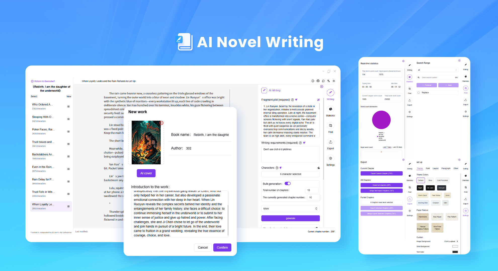
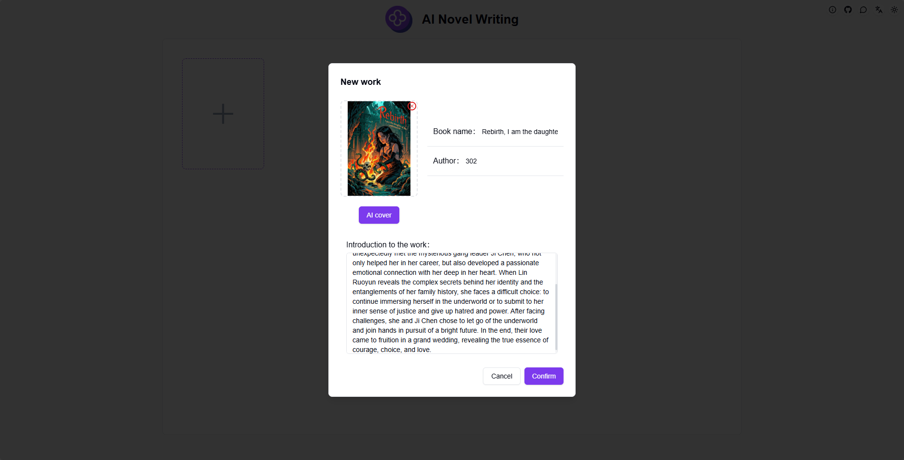
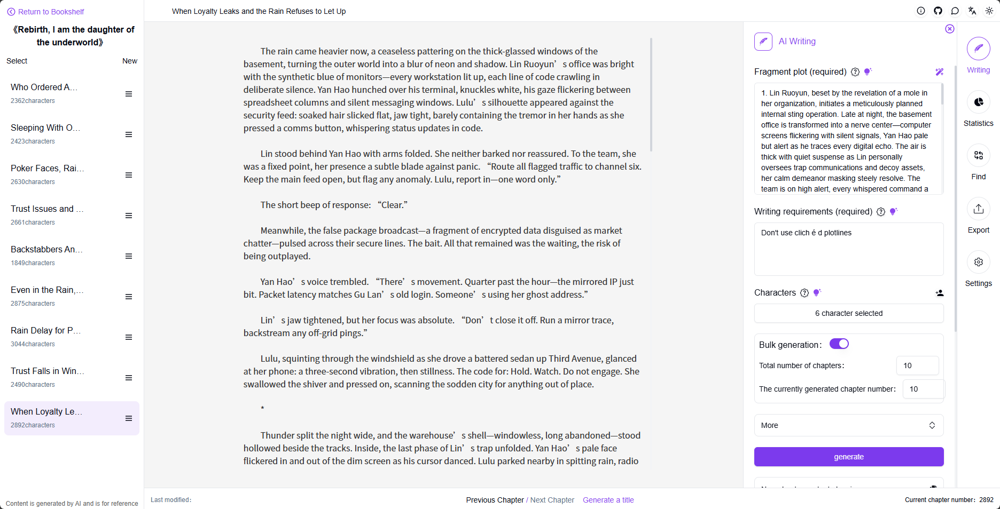
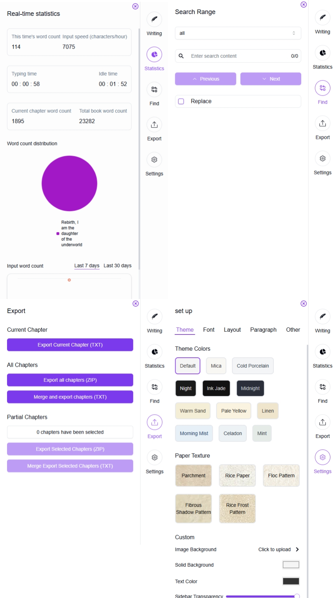

# <p align="center"> 📚 AI Novel Writing 🚀✨</p>

<p align="center">AI Novel Writing supports manual writing for work editing, and can also use AI to generate novel passages, bringing different inspirational collisions. It also provides various writing assistance features to make you fall in love with writing.</p>

<p align="center"><a href="https://302.ai/product/detail/70" target="blank"></a></p >

<p align="center"><a href="README_zh.md">中文</a> | <a href="README.md">English</a> | <a href="README_ja.md">日本語</a></p>



This is the open-source version of the [AI Novel Writing](https://302.ai/product/detail/70) from [302.AI](https://302.ai/en/). You can directly log in to 302.AI to use the online version with zero code and zero background, or modify and deploy it yourself according to your requirements.

## Interface Preview
Enter the book title, author, and synopsis to create a new work. The novel cover can be AI-generated or uploaded locally.


Use the AI writing feature in the sidebar to generate novel chapters, or manually or automatically generate a complete novel. You can also manually type in the middle editor to modify your work.


The sidebar has more auxiliary functions to make you fall in love with writing.


## Project Features
### 📝 AI-Assisted Writing
Generate novel chapter content through AI, providing inspiration and creative support.
### 📖 Diverse Writing Styles
Supports various writing styles including modern, ancient, fantasy, and more, meeting different creative needs.
### 🎯 Intelligent Plot Planning
Generate chapter plot planning through AI.
### 🔄 Real-time Editing and Modification
Supports real-time editing and modification features to adjust content at any time.
### 🌓 Dark Mode
Supports dark mode to protect your eyes.
### 🌍 Multi-language Support
- Chinese Interface
- English Interface
- Japanese Interface

## 🚩 Future Update Plans
- [ ] Add character relationship mapping functionality
- [ ] Support collaborative writing mode

## 🛠️ Tech Stack

- **Framework**: Next.js 14
- **Language**: TypeScript
- **Styling**: TailwindCSS
- **UI Components**: Radix UI
- **State Management**: Jotai
- **Form Handling**: React Hook Form
- **HTTP Client**: ky
- **i18n**: next-intl
- **Theming**: next-themes
- **Code Standards**: ESLint, Prettier
- **Commit Standards**: Husky, Commitlint

## Development & Deployment
1. Clone the project
```bash
git clone https://github.com/302ai/302_novel_writing
cd 302_novel_writing
```

2. Install dependencies
```bash
pnpm install
```

3. Configure environment
```bash
cp .env.example .env.local
```
Modify the environment variables in `.env.local` as needed.

4. Start development server
```bash
pnpm dev
```

5. Build for production
```bash
pnpm build
pnpm start
```

## ✨ About 302.AI ✨
[302.AI](https://302.ai/en/) is an enterprise-oriented AI application platform that offers pay-as-you-go services, ready-to-use solutions, and an open-source ecosystem.✨
1. 🧠 Comprehensive AI capabilities: Incorporates the latest in language, image, audio, and video models from leading AI brands.
2. 🚀 Advanced application development: We build genuine AI products, not just simple chatbots.
3. 💰 No monthly fees: All features are pay-per-use, fully accessible, ensuring low entry barriers with high potential.
4. 🛠 Powerful admin dashboard: Designed for teams and SMEs - managed by one, used by many.
5. 🔗 API access for all AI features: All tools are open-source and customizable (in progress).
6. 💡 Powerful development team: Launching 2-3 new applications weekly with daily product updates. Interested developers are welcome to contact us.
