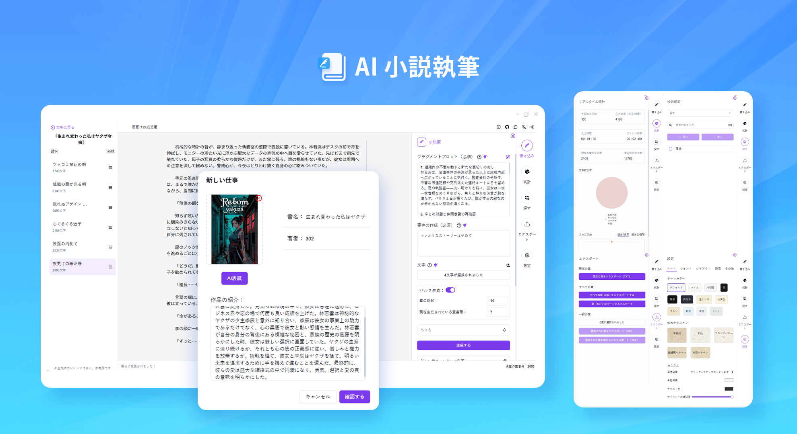
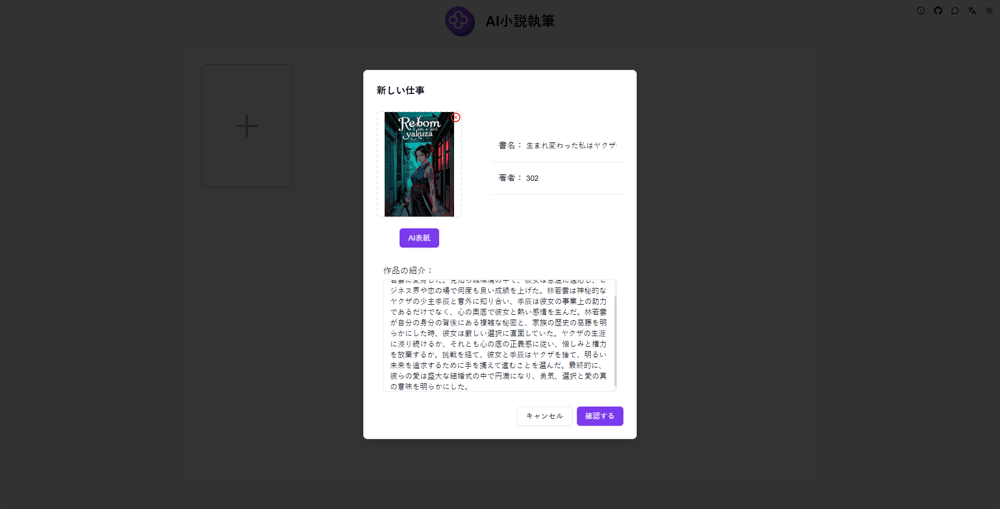
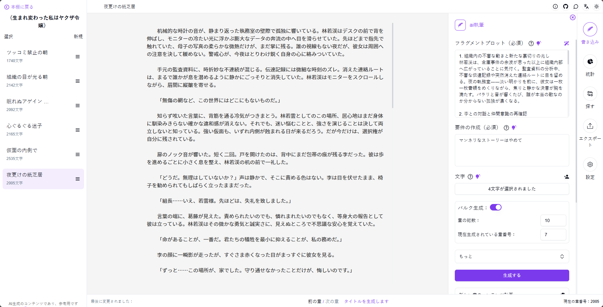
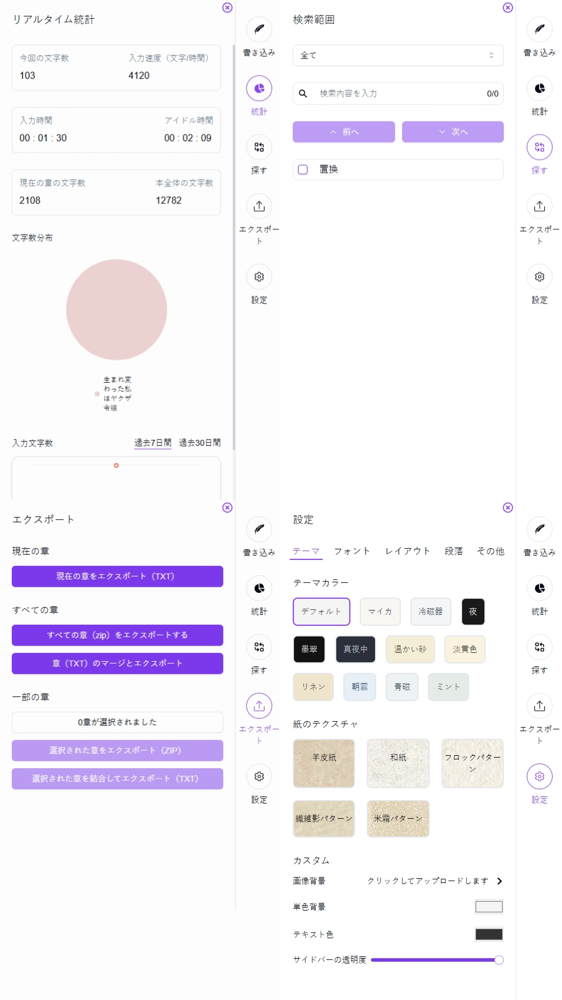

# <p align="center"> 📚 AI小説執筆 🚀✨</p>

<p align="center">AI小説執筆は、手動での文字入力による作品編集をサポートし、AIによる小説の段落生成も可能で、異なるインスピレーションの融合をもたらします。また、様々な執筆支援機能を提供し、執筆を楽しむことができます。</p>

<p align="center"><a href="https://302.ai/ja/tools/novel/" target="blank"></a></p >

<p align="center"><a href="README_zh.md">中文</a> | <a href="README.md">English</a> | <a href="README_ja.md">日本語</a></p>



[302.AI](https://302.ai/ja/)の[AI小説執筆](https://302.ai/ja/tools/novel/)のオープンソース版です。
302.AIに直接ログインすることで、コード不要、設定不要のオンライン体験が可能です。
あるいは、このプロジェクトをニーズに合わせてカスタマイズし、302.AIのAPI KEYを統合して、自身でデプロイすることもできます。

## インターフェースプレビュー
書名、作者、概要を入力するだけで新しい作品を作成でき、小説の表紙はAIで生成することも、ローカルからアップロードすることもできます。


サイドバーのAI執筆機能を使用して小説の章を生成したり、手動または自動で完全な小説を生成したりできます。また、中央のエディターで手動で文字を入力して作品を修正することもできます。


サイドバーにはさらに多くの補助機能があり、執筆を楽しむことができます。


## プロジェクトの特徴
### 📝 AI執筆支援
AIを通じて小説の章の内容を生成し、インスピレーションと創造的なサポートを提供します。
### 📖 多様な執筆スタイル
現代、時代物、ファンタジーなど、様々な執筆スタイルをサポートし、異なる創作ニーズに対応します。
### 🎯 インテリジェントなプロット計画
AIを通じて章のストーリー展開を計画します。
### 🔄 リアルタイム編集と修正
リアルタイムの編集と修正機能をサポートし、いつでも作品内容を調整できます。
### 🌓 ダークモード
ダークモードをサポートしており、あなたの目を保護します。
### 🌍 多言語サポート
- 中国語インターフェース
- 英語インターフェース
- 日本語インターフェース

## 🚩 将来のアップデート計画
- [ ] キャラクター関係図機能の追加
- [ ] 共同執筆モードのサポート

## 🛠️ 技術スタック

- **フレームワーク**: Next.js 14
- **言語**: TypeScript
- **スタイリング**: TailwindCSS
- **UIコンポーネント**: Radix UI
- **状態管理**: Jotai
- **フォーム処理**: React Hook Form
- **HTTPクライアント**: ky
- **国際化**: next-intl
- **テーマ**: next-themes
- **コード規約**: ESLint, Prettier
- **コミット規約**: Husky, Commitlint

## 開発&デプロイ
1. プロジェクトのクローン
```bash
git clone https://github.com/302ai/302_novel_writing
cd 302_novel_writing
```

2. 依存関係のインストール
```bash
pnpm install
```

3. 環境設定
```bash
cp .env.example .env.local
```
必要に応じて`.env.local`の環境変数を修正してください。

4. 開発サーバーの起動
```bash
pnpm dev
```

5. プロダクションビルド
```bash
pnpm build
pnpm start
```

## ✨ 302.AIについて ✨
[302.AI](https://302.ai/ja/)は企業向けのAIアプリケーションプラットフォームであり、必要に応じて支払い、すぐに使用できるオープンソースのエコシステムです。✨
1. 🧠 包括的なAI機能：主要AIブランドの最新の言語、画像、音声、ビデオモデルを統合。
2. 🚀 高度なアプリケーション開発：単なるシンプルなチャットボットではなく、本格的なAI製品を構築。
3. 💰 月額料金なし：すべての機能が従量制で、完全にアクセス可能。低い参入障壁と高い可能性を確保。
4. 🛠 強力な管理ダッシュボード：チームやSME向けに設計 - 一人で管理し、多くの人が使用可能。
5. 🔗 すべてのAI機能へのAPIアクセス：すべてのツールはオープンソースでカスタマイズ可能（進行中）。
6. 💪 強力な開発チーム：大規模で高度なスキルを持つ開発者集団。毎週2-3の新しいアプリケーションをリリースし、毎日製品更新を行っています。才能ある開発者の参加を歓迎します。
